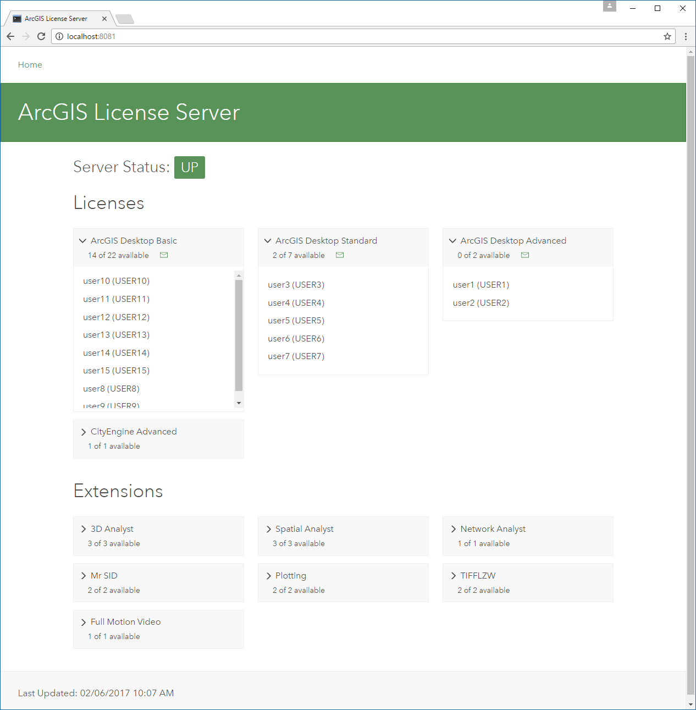

# arcgis_license_processor
A Python module that returns a dictionary object from your ArcGIS License Manager output.

# Overview
This code will give you a python dictionary that can be used for various purposes.  I take the data and use Flask to output the results to an internal website that our users can reference for license availability.

# Windows Server Installation
1. Setup a scheduled task to run the following command to export your license manager.  Make sure to update the target path with a proper path on your server. 

    `"C:\Program Files (x86)\ArcGIS\License10.5\bin\lmutil.exe" lmstat -a -c "C:\Program Files (x86)\ArcGIS\License10.5\bin\service.txt" > C:\export\path\CheckLicenses.log`

     _*This example is using ArcGIS 10.5's license manager).  If you want the scheduled task to export at an interval less than 1 minute, you will need multiple scheduled tasks that start at different times (e.g. offset by 15 seconds) that overwrite the same file.*_

2. Update config.py with the appropriate paths.  Search for `{server}` in case the line #'s change.
3. From a command line... `python run_script.py` to view a pretty-printed output from the dictionary object.

